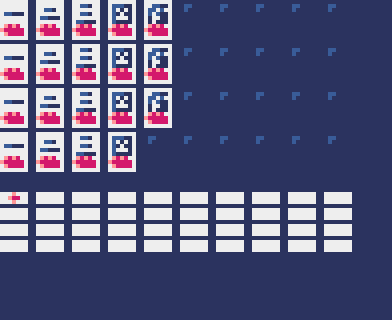
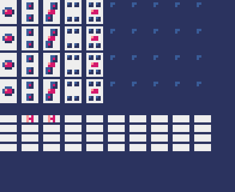
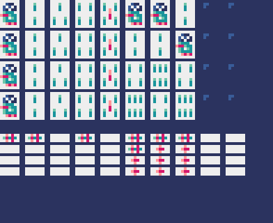
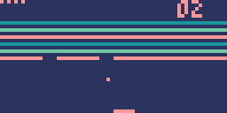
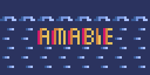
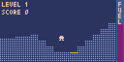
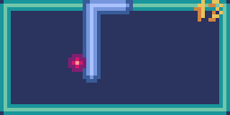
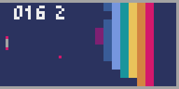

# Pyxel games and demos

Games and demos written in Pyxel/Python 
[DevNote](doc/220218_PyxelNote.md) is here.

## Game list

|No.|Date|Title|Platform|Content|
|---|----|----|---------|-------|
|1|2025-03-02|[mastermind](mastermind)|Pyxel|  |
|2|2025-03-09|[breakout](breakout)|Pyxel||
|3|2025-03-10|[amabie](amabie)|Pyxel||
|4|2025-03-21|[lander](lander)|Pyxel||
|5|2025-04-25|[snake](snake)|Pyxel||
|6|2025-05-30|[vbrix](vbrix)|Pyxel||

## Demo list

|No.|Date|Title|Platform|Content|
|---|----|----|---------|-------|
|1|2025-05-10|[tank](tank)|Pyxel||
